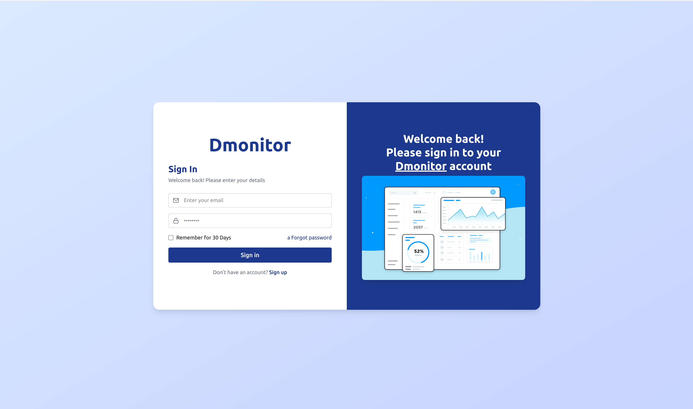
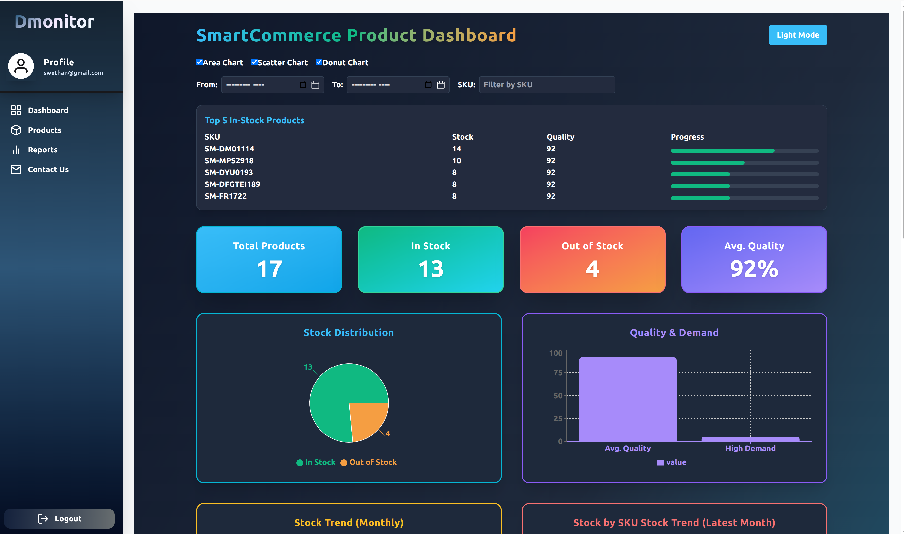
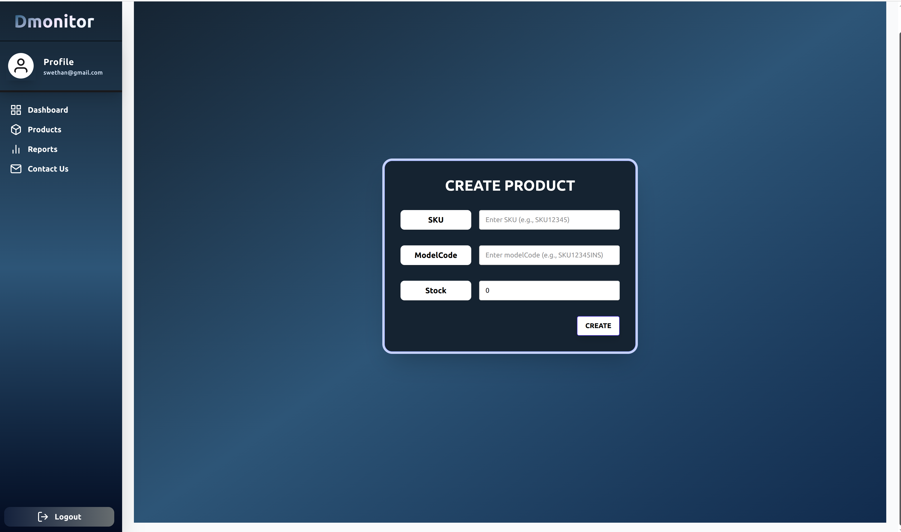

# AI-SMARTCOMMERCE-SENTINEL

AI-SmartCommerce-Sentinel - Products Creation, updation, deletion with stock, quality and demand tracking

## Tech Stack - React Redux Recharts Tailwindcss DaisyUI Node Express Mongoose

### Highlights:

- JWT authentication for SIGNUP & SIGNIN
- SKU creation, Updation, Deletion
- Get Product info by Sku
- Get all products info
- Role based restriction for Creation, Deletion and Updation
- Get all products and get product by sku allowed to be access for all users.
- Maintain stock, quality and demand tracking info
- Using Dashboard for visualization info
- Filter stock, quality and demand tracking info by date range
- Toggle Dark/Light theme for Dashboard
- Impressive and modern UI using Tailwind CSS and Daisy UI

 

## AUTHOR

- [@SwethaNatarajan](https://github.com/SwethaNatarajan29-12)

# Hi, I'm Swetha Natarajan, an Engineer.

## 🔗 Links

LinkedIn - https://www.linkedin.com/in/swetha-natarajan-61560a20a
